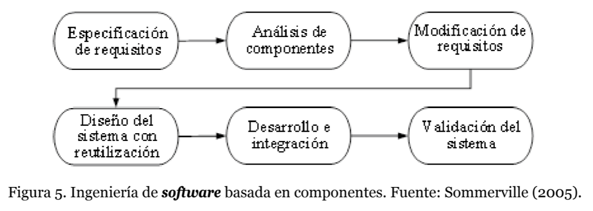
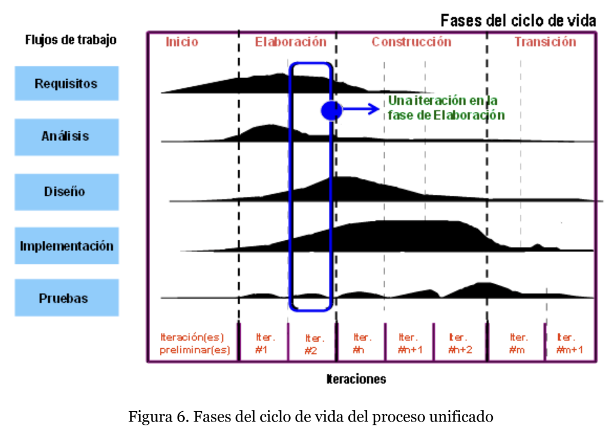

# El proceso de desarrollo de **software**

### Que estudia este tema?

Se estudiara el proceso de desarrollo y los modelos mas comunes a la hora de implementar una aplicacion. Las caracteristicas propias del proyecto haran que este tenga que ir cambiando su modelo para dar solucion a los problemas que surgen.

### Definicion

> Un proceso define: Quien esta haciendo `que, cuando y como` para alcanzar un objetivo

*Este objetivo puede ser desarrollar, modificar o expandir un software ya existente*

Este proceso de desarrollo de software se ha definido de diferentes maneras
- *El conjunto de actividades necesarias para transformar los requisitos en un sistema. Jacobson, Booch y Raumbaugh.*
- *El conjunto de actividades para la creacion de un software. Sommerville.*
- *El conjunto de herramientas, metodos y practicas que utilizamos para crear un software. Humphrey.*

Sin importar la definicion son los ingenieros de software los que llevan a cabo este conjunto de actividades y seleccion de herramientas para la realizacion del desarrollo.

Toda actividad de desarrollo de software va a generar dos tipos de artefactos:
- Artefacto interno del proceso de desarrollo
- Artefacto entregable al cliente
*Un artefacto se puede definir como una pieza de informacion que se produce en un proceso de desarrollo de software*

Todo proceso de desarrollo de software debe definir el problema solucionado para favorecer la comprencion del codigo y el diseño de la solucion asi anticipando de manera ordenada los problemas para poder elaborar las formas de prevenir y resolver riesgos potenciales. Humphfrey (1990) destaca que el mayor interes del software debe ser la **calidad**.

`Requisitos de usuario -> Proceso de desarrollo de software -> Producto software`

Sommerville (2005) destaca cuatro actividades fundamentales comunes en los procesos de desarrollo:

- **Especificacion**. Clientes e ingenieros definen que van a construir y las restricciones que tendra.
- **Desarrollo**. Se diseña e implementa a la vez que se verifica su calidad.
- **Validacion**. Se valida que sea valioso para los clientes teniendo en cuenta los requisitos
- **Evolicion**. El software cambia para adaptarse a los cambios del cliente y/o mercado.

### Modelo de proceso software

Un **modelo de proceso** de desarrollo es una **descripcion simplificada** de un proceso de desarrollo real. Aun tratandose de una *simplificacion* del proceso es esto su principal ventaja: un modelo de proceso software deberia ser **facil de entender** por sus desarrolladores.

Cada desarrollo va a adoptar un modelo que mejor se le adapte dependiendo de su **complejidad** y sus **caracteristicas** del sistema. La eleccion inadecuada del modelo de proceso va a tener un gran impacto en la calidad del software.

#### Modelo en cascada

El *modelo en cascada (waterfall model)* fue el **primer paradigma** de proceso de desarrollo de software y se deriva de los procesos usados en las otras ingenierias de productos fisicos. Toma las *cuatro actividades comunes (especificacion, desarrollo, validacion y evolucion),* y presenta cada una como un momento distinto.

1. Especificacion de requisitos.
2. Diseño del software.
3. Implementacion
4. Pruebas
*Cada fase debe ser aprobada para poder continuar a la siguiente*

Desgraciadamente, este modelo es poco realista debido a que el modelo es poco flexible y es muy improbable encontrar software que se beneficie de esto.

#### Modelo en espiral

Desarrollada por Boehm (1988) y representa el proceso como una espiral que `comprende tanto el modelo iterativo y el modelo incremental` debido a su diseño **exclusivo** para soportar iteraciones que añaden funcionalidades al sistema hasta llegar a tener un sistema completo.

Cada bucle puede significar una fase del proceso

1. Viabilidad del sistema
2. Definicion de requistos
3. Diseño del sistema
4. etc...

Y asi mismo este bucle se divide en cuatro:

1. Establecimiento de objetivos
2. Evaluacion y reduccion de riesgos
3. Desarrollo y validacion
4. Planificacion

#### Ingenieria de Software basada en componentes (CBSE)

Aunque sea de manera informal, en todos los proyectos de software se va a dar la *reutilizacion* siendo este enfoque basado en la creacion de modulos reutilizables

> Un software que use el modelo de componentes podra ser distribuido e integrado a un cliente si hay un estandar de diseño y composicion

Esto expone el interes por integrar componentes de manera sistematica al software en vez de construirlo desde cero.

*mencionamos tambien a otro enfoque muy relacionado llamada* **arquitectura orientada a servicios (SOA)** *en el cual la funcionalidad se basa no en modulos sino servicios que se comunican mediante protocolos de mensajes*

Desde un punto de vista conceptual se puede considerar a un servicio como un componente de la solucion aunque en realidad estos servicios se componen por componentes que se comunican a traves de interfaces bien definidas.

El modelo SOA se destaca por:
- **Autonomo**. Cada servicio se mantiene, desarrolla, despliega y evoluciona de manera independiente
- **Distribuido**. Estos servicios pueden estar en cualquier red que soporte los protocolos de comunicacion
- **Debilmente acoplado**. Cada servicio es independiente y asi mismo puede ser reemplazado y cambiado sin afectar la solucion global.
- **Compatibilidad basada en politicas**. Hace referencia al modo de envio, protocolos y seguridad.

Estos tipos de aplicaciones SOA son muy conocidad por el modelo de servicio *Software as a Service (SaaS)* donde los usuarios acceden a travez de un navegador para usar el servicio.

### El proceso unificado de desarrollo de software

El **proceso unificado de desarrollo de software (USDP)** o tambien conocido como **proceso unificado (UP)** corresponde a un proceso de desarrollo basado en componentes a travez de moldes bien definidos. El componente seria una parte reemplazable que se ajusta para cumplir un objetivo.

Ademas el proceso unificado utiliza **Unified Modeling Language (UML)** para diseñar sus artefactos. Los aspectos distintivos de UP son:
- **Dirigido a los casos de uso**. El proceso de desarrollo se da a medida que los casos de uso aparecen.
- **Centrado en la arquitectura**. Al igual que en un edificio se incluye los aspectos estaticos y dinamicos mas importantes en el sistema.
- **Iterativo e incremental**. La idea es dividir el peso en varios mini-proyectos que acumulados dan los incrementos de funcionalidades del software y cada uno de estos proyectos tienen los mismos elementos que un proyecto de escala completa. Cada incremento presenta los cinco **flujos de trabajo**

1. Requisitos
2. Analisis
3. Diseño 
4. Implementacion
5. Pruebas

Este proceso se va a repetir a lo largo de los ciclos de desarrollo, cada uno siendo una version y en general se ven divididos en cuatro fases:

1. **Inicio**. Durante se describe el producto final y se presenta el analisis del producto.
2. **Elaboracion**. Se especifican los casos de uso y se diseña la arquitectura del sistema
3. **Construccion**. Se crea el producto y la linea base de artifactos revisados y aprobados
4. **Transicion**. El producto se convierte en la etapa de *beta* dpmde se corrigen errores e incorporan mejoras.

Cada fase es marcada con un **milestone (hito)** definido por el estado de los artefactos.

### Proceso Unificado de Rational

**Rational Unified Process (RUP)** es un producto comercial de *IBM* realizado por la colaboracion del UML y el USDP. En otras palabras `RUP es una variante comercial de UP`.

Este defiende que los modelos convencionales presentan una sola perspectiva mientras el se desarrolla en tres:

1. **Perspectiva estatica**. Muestra los flujos de trabajo
- *Modelado de negocio* que modela los procesos respecto a los casos de uso
- *Requisitos* que identifican los actores que modelan los requisitos
- *Analisis y diseño* documenta el modelo de diseño con otros modelos (arquitectonicos, componentes, objetos y secuencia)
- *Implementacion, pruebas, despliegue, gestion de configuracion y cambio, gestion del proyecto y entorno*

2. **Perspectiva dinamica**. Muestra las fases del proceso a lo largo del tiempo.

3. **Perspectiva practica**. Sugiere las buenas practicas a realizar en el proceso.

Esta distincion entre fases y flujos de trabajos es una de las innovaciones mas importantes de *RUP*.

`Las fases son dinamicas y tienen objetivos. Los flujos son estaticos y tienen actividades no asociadas a ninguna fase.`

Esto es util cuando en el documento, codigo y diseño se comparten los mismos conceptos con la misma palabra. *Ej: tener una clase Transaccion en el codigo que signifique lo mismo en el diseño y en la documentacion del usuario*

Las buenas practicas recomendadas por RUP para el desarrollo de sistemas son:

- **Desarrollar software de manera iterativa** Planificar los incrementos basandose en las prioridades del cliente priorizando caracteristicas sobre otras.
- **Gestion de requisitos**. Documentar los requisitos y llevar el control de los cambios para analizar el impacto sobre el sistema antes de aceptarlos.
- **Uso de arquitecturas basadas en modulos**.
- **Modelado visual del software**. Con modelos graficos UML.
- **Verificar la calidad del sistema**. Comprobar que el software cumple los estandares de calidad,
- **Controlar los cambios que se producen en el software**. Usa procesidmientos para controlar las modificaciones que se van a producir en el sistema.

`Aunque RUP no puede ser adaptado a todos los proyectos, si se ha acercado a ser un acercamiento valido a un framework con elementos que podrian ser adaptados a cada caso`

Sin embargo no se encuentran muchas directrices que indiquen como se harian estas adaptaciones, para esto, *Hanssen, Westerheim y Bjørson (2005)* realizaron un estudio para describir estas adaptaciones de RUP

1. Se adapta de manera individual, lo cual implica mucho trabajo
2. Se adapta generando otra version del framework, un subconjunto de RUP
3. La organizacion describe los distintos proyectos que abarcara y el framework se adapta a cada uno de ellos.

Aun con esto se han detectado diversos problemas y limitaciones en RUP. Asi ha nacido una nueva aproximacion conocida como **Essential Unified Proces (EssUP)** que recoge diversas tecnicas de su predecesor y de el modelo **Capability Maturity Model Integration (CMMI)** y el desarrollo agil para su aplicacion a los proyectos.

# DESARROLLEN LOS EJERCICIOS AL FINAL DEL PDF QUE EL PROFE SUBIO AL GOOGLE CLASSROOM PAGINA 24
