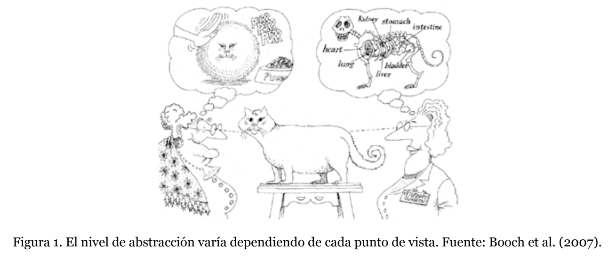
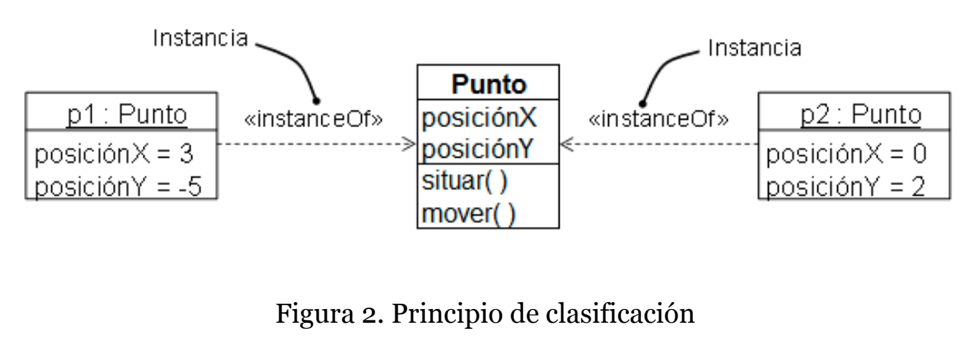
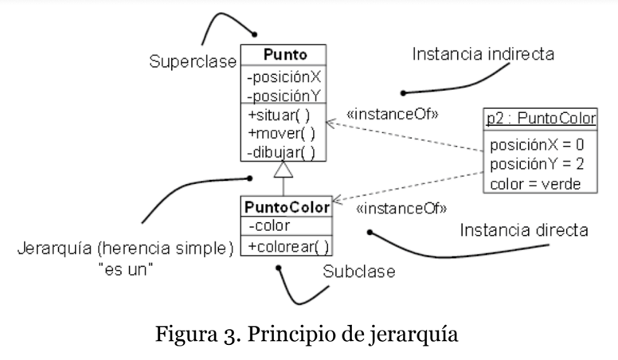
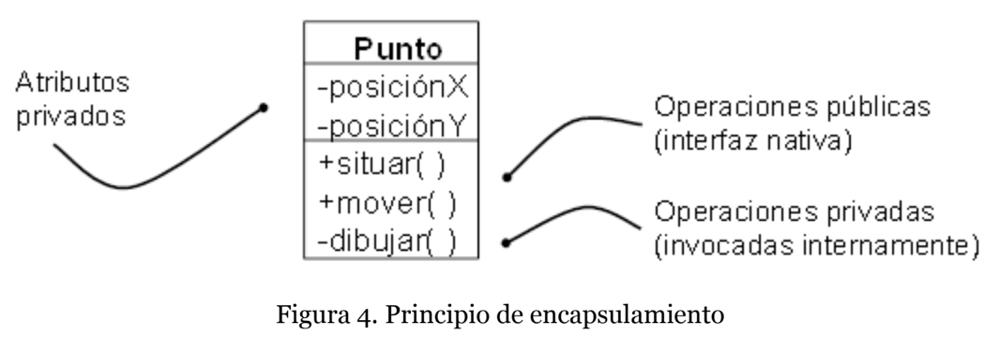
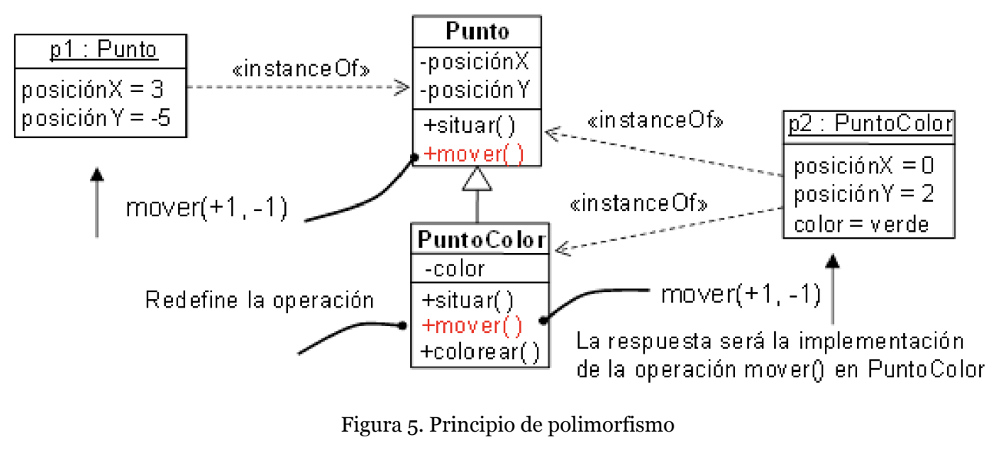
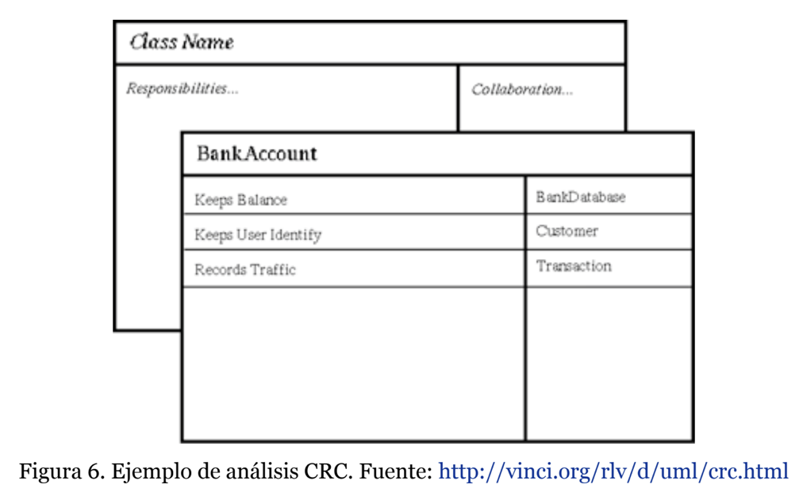
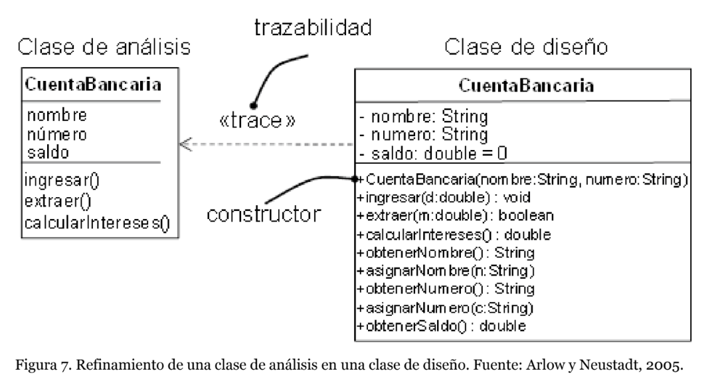

# Desarrollo de software orientado a objetos

### Que estudia este tema?

Se estudian los conceptos asociados a la *orientacion de objetos (OO)* y sus principios fundamentales: **abstraccion, jerarquia, clasificacion, encapsulamiento y polimorfismo**. Ademas de diferenciar entre el analisis oriantado a objetos (AOO) y el disenho orientado a objetos (DOO).

### Introduccion

El concepto de programacion orientada a objetos (OOP) aparecio en los lenguajes de programacion con *Smalltalk* cuando se consolido de manera definitiva. OOP se basa en la idea de un mundo lleno de objetos con *atributos* que los diferencias y las *operaciones* que pueden ser realizadas sobre ellos.

Estos atributos representan y almacenan datos, mientras las operaciones permiten manipular los atributos.

> Los programas orientados a objetos se contruyen mediante objetos que colaboran entre si mediante el intercambio de mensajes.

Asi mismo el OOP es un **metodo de implementacion** en el que os programas son colecciones de objetos que colaboran unos con otros y cada objeto representa una clase determinada, estas clases forman jerarquias que se pueden relacionar a travez de la **herencia**.

La gran diferencia entre OOP es su uso de objetos y no de los algoritmos para el desarrollo. Cada objeto debe venir definido por una **clase**.

*Los lenguajes orientados a objetos son: C++, Objective C, C#, Self, Eiffel y, mas conocido, Java*.

Para que un lenguaje sea considerado OOP se deben cumplir las siguientes condiciones:

1. Los objetos son maquetas o prototipos de como se organizan los datos y contienen las operaciones disponibles por cada objeto.
2. Los objetos tienen un tipo de dato asociado llamado **clase**
3. Las clases pueden heredar atributos de otra clase, a estas ultimas se les llama **superclases**

El disenho orientado a objetos fue utilizado por primera vez por Booch para posteriormente ser derivado en el desarrllo orientado a objetos.

Todos los objetos dependen de los problemas encontrados durante el analisis y son definidos en el disenho de la solucion, entonces es el *analisis orientado a objetos (OOA)* el que define los objetos a construir.

*El disenho orientado a objetos propone una solucion al problema mendiante crear y combinar objetos*

El OO parte de que el mundo real se puede representar por entidades conceptuales cuyas instancias colaboran entre si, sin embargo, si se es capaz de identificar los objetos pero no su colaboracion no tendria sentido este acercamiento.

Las ventajas de este enfoque son:

- **Analisis**. Se analizan los problemas a un nivel mayor de abstraccion
- **Comunicacion**.
- **Tolerancia**. Los objetos tienen mayor tolerancia a los cambios de enfoque
- **Reutilizacion**.
- **Verificacion**
- **Extensibilidad**

### Principios de la orientacion a objetos

#### Abstraccion

> La abstraccion son aquellas caracteristicas esenciales de un objeto que lo distingue de otros

Para un programador la abstraccion es una forma de simplificar la realidad.

- **Abstraccion de Entidad**. Representa un modelo util de una entidad
- **Abstraccion de Accion**. Proporcia un conjunto de operaciones con el mismo objetivo
- **Abstraccion de Maquina Virtual**. Agrupa operaciones que son usadas por otras en un conjunto de operaciones auxiliares
- **Abstraccion casual**. Operaciones que no tienen relacion entre si.

Dentr de la abstraccion se denomina *cliente* a cualquier objeto que use recursos de otro objeto (conocido como *servidor*) necesitando definir un protocolo. Este protocolo se define como *el conjunto de operaciones que hace un cliente para acceder a un servidor junto a sus restriccones* y estos requisitos delegados a un *objeto servidor* se denomina **responsabilidad**.

#### Clasificacion

Los objetos son clasificados entre la relacion entre las clases. La clasificacion permite asignar un tipo a los objetos y los objetos de diferente tipo no se pueden intercambiar, y en el caso de poderse intercambiar, lo haran de manera muy restrictiva.

- **Fuerte vs debil**. Se considera fuerte cuando no se deja invocar la operacion de un objeto a menos que este definida en la clase o superclase de dicho objeto.

- **Estatica vs dinamica**. Se refiere a lo conocido como el *tipado* de variables y que sea estatico significa que se deben fijar en tiempo de compilacion mientras que una clasificacion dinamica permite que los tipos de las variables no se conozcan hasta el tiempo de ejecucion.

*Un lenguaje estatico fuertemente tipado seria Ada mientras que C++ y Java son fuertemente tipados pero dinamicos. En otro extremo se encuentra Smalltalk sin tipado y dinamico*

#### Jerarquia

Las jerarquias permiten ordenar las abstracciones. Una manera de entenderlos es con `es un/una` de manera que `Empleado es una Persona` asi podemos ver como el mecanismo de herencia crea clases a partir de otras ya existentes. Esta subclase va a heredad la estructura y comportamiento de la superclase.
*Dependiendo del lenguaje una clase va a poder heredar de una o varias*

#### Encapsulamiento

El principio OO permite separa la interfaz de la implementacion en una clase. Su objetivo es reducir la combinacion entre las clases. La idea es que la comunicacion se realice a traves de mensajes y por eso todo atributo o metodo que se considere de uso interno de la clase se va a definir como privado mientras que las responsabilidades se van a definir como publicas. Las interfacesencapsulan el conocimiento.

#### Polimorfismo

Es lo que permite a los objetos actuar de manera distinta usando la misma operacion. *Un objeto perro se mueve diferente que un objeto serpiente pero ambos se mueven y la posibilidad de reescribir el metodo "mover" es el polimorfismo*.
Toda operacion que no sea polimorfica se considera como **concreta**.

### Definicion de Objeto

> Un objeto es una entidad discreta con identidad, estado y comportamiento que se puede invocar, son piezas individuales de un sistema.

Asi los objetos son entidades del mundo real tienen un estado que representa los atributos del objeto y las operaciones son los servicios (funciones) y una identidad unica.

- **Identidad**. Unica de cada instancia de los objetos.
- **Estado**. Determinado por los valores de los atributos
- **Comportamiento**. Define las capacidades del objeto.

### Definicion de una clase

> Una clase es el molde para un conjunto de objetos con estructura, comportamiento y relaciones similares.

Una clase describe el prototipo de todos los objetos que pertenecen a ella, se definen en dos niveles:

1. **Primer nivel**. Son representaciones de entidades concretas. *Ej: La clase Perro tiene entidades como pueden ser Rex, Anubis o Akamaru*
2. **Segundo nivel**. Son representaciones de un conjunto de entidades. *Ej: la clase "Raza de perros" que es un conjunto no tangible*

La clase seria ese molde de creacion de objetos que incluye los atributos y operaciones que dicho objeto tendra.
Los objetos pueden comunicarse entre uno y otros mediante asociaciones.

Una asociacion es el conjunto de conexiones entre los objetos.

### Analisis orientado a objetos vs disenho orientado a objetos

El analisis permite el desarrollo correcto del sistema debido a que es importantisimo describir los conceptos y objetos que competen al sistema.

Las clases de analisis deberian mostrar una abstraccion muy alta del problema y deben corresponder con conceptos del mundo real por tanto no debe haber paso a ninguna ambiguidad ni inconsistencia. Una clase de analisis deberia tener por lo menos:

- **Nombre**.
- **Atributos**.
- **Operaciones**. Deben ser de nivel muy alto.
- **Visibilidad**.
- **Estereotipos**. A este nivel muestra si mejora la comprension del problema.
- **Valores etiquetados**. Solo deben mostrarse si aportan a la comprension del problema.

> Pressman considera que para encontrar las clases se debe subrayar cada sustantivo o frase que puede ser considerada una clase e incluirlo en una tabla teniendo cuidado de tambien incluir sinonimos.

Las clases de analisis podrian adoptar las siguientes formas:

- **Entidades externas**. Producen y usan la informacion del sistema. Pueden ser personas o dispositivos.
- **Artefactos**. Que reflejen dominio de la informacion, pueden ser informes, senhales o pantallas.
- **Eventos**. Producidos dentro del sistema (una transferencia bancaria o el movimiento de un robot)
- **Roles**. Desempenhados por los actores del sistema. Puede ser el cliente o el mismo vendedor del software
- **Unidades organizacionales**. Son los diferentes departamentos y equipos involucrados.
- **Lugares**. Determinan el contexto de uso del software
- **Estructuras**. Definen conjuntos de objetos o clases relacionadas a ellos (computadores, sensores, vehiculos).

No son exclusivas y se pueden resumir en clases **productoras** y **consumidoras**. Esto fue llamado tecnica de analisis *calse-responsabilidad-colaborador (CRC)*

Hay parametros dados para definir la valides de un analisis:
- Su nombre refleja su intencion
- Corresponde una abstraccion a muy alto nivel
- Es una caracteristica identificable dentro del dominio
- Tiene un conjunto limitado y bien definido de responsabilidades
- Es altamente cohesivo
- Presenta bajo acoplamiento (dependencia con otros)

En lo que respecta a DOO hay un interes alto en los objetos que van a ser traducidos a codigo y la forma en la que los requisitos interactuan entre si.

Arlow y Neustadt (2005) habla de dos clases principales de disenho:

- El refinamiento del analisis en donde se agregan los detalles de su implementacion
- El dominio de la solucion que proporciona herramientas para implementar el software

Pressman define sus propias clases de disenho en cinco:

1. **Interfaz de usuario**. Definido por las abstracciones necesarias para la interaccion humano maquina.

2. **Dominio del negocio**. Corresponde al refinamiento del analisis para implementacion.

3. **Proceso**. Implementan abstracciones de bajo nivel para asegurar la gestion completa

4. **Persistentes**. Habla de los datos que van a existir asi el software no este siendo ejecutado

5. **Sistema**. Administra y controla el software para que la aplicacion opere dentro y fuera del sistema en si.

`A medida que esta arquitectura se va creando, el nivel de abstraccin se va reduciendo` y cabe aclarar que hay que tener en cuenta todo lo que haga parte del dominio del problema mas no solo de la solucion.

|**Recomendacion**|**Descripcion**|
|-----------------|---------------|
|Adquisicion de los requisitos preliminares|Realizar un informe breve del problema|
|Familiarizarse con el dominio|Analizar tareas ya existentes, objetivos y procesos del negocio|
|Imaginarse el dominio una vez ya se haya hecho el despegue|Centrarse en el uso de los usuarios|
|Dependiendo del dominio, enfocarse en aspectos estaticos y dinamicos|Intentar definir primero, a muy alto nivel, la vista estatica y dinamica del software|
|Profundizar en el sistema propuesto por el analisis|El DOO debe basarse del AOO para el desarrollo|
|Crear la arquitectura del sistema propuesto por el modelo AOO|Se enfoca en la parte dinamica del modelo AOO|
|REVISAR MAS EN EL DOCUMENTO|MUY LARGO Y ALLA LO EXPLICAN BIEN PAG 19|

*Debido a que el mundo real y el dominio del negocio son en si un conjunto de objetos hay autores que proponen que el sistema deje de ser parte del analisis y sea parte del disenho*

Hay (1999) es un autor que defiende que el sistema no puede ser visto solo desde el analisis debido a las limitaciones que tienen. Por ejemplo, no pueden explicar la herencia sin usar una linea de codigo o el impedimento de nombres que contengan espacios y esto nace de problemas de comunicacion que impiden el AOO ser visto como un analisis en estado puro.

Zachman clasifica diferentes perspectivas para entender esta problematica:

- **Alcance**. Entender los objetivos de la organizacion
- **Vista del propietario del negocio**. No hace referencia a los stakeholders sino a las personas operando el negocio.
- **Vista del arquitecto**. La representacion en estructuras fundamentales y tecnologicamente independientes del negocio.
- **Vista del disenhador**. Aplicar la tecnologia para gestionar los requisitos del sistema descubiertos por el arquitecto.
- **Vista del desarrollador**.
- **Vista de produccion**. El sistema completo, ya finalizado.

# REALIZEN LAS ACTIVIDADES EN LA PAG 28

