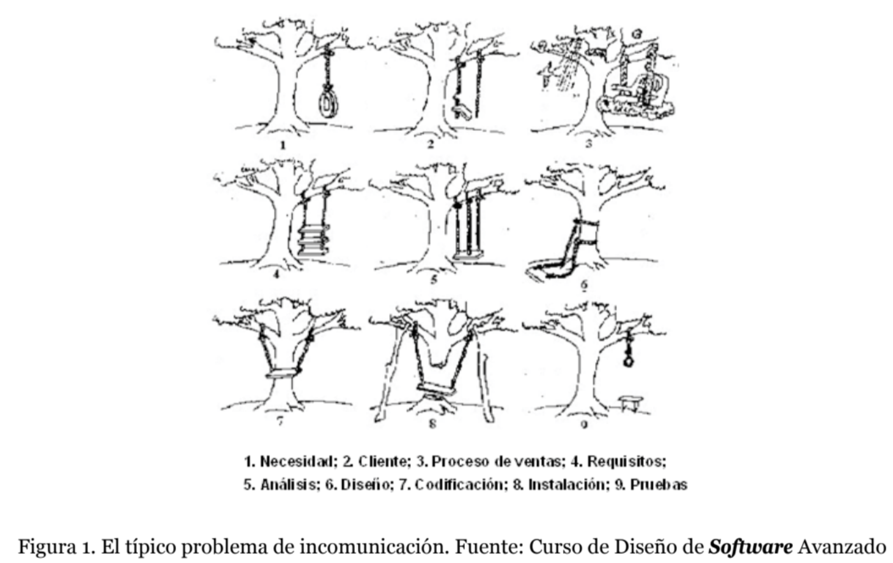

# Modelado de aplicaciones con UML

### Que estudia este tema?

Se trabajaran los conceptos de modelado con UML y se analizara con detalle ciertos elementos de la ingenieria de requisitos.

### Modelo avanzado de requisitos

La extraccion de requisitos puede que sea la mas critica de las tareas a realizar en proyectos.

Los modelos deben ser una herramienta para la comunicacion entre los clientes y contratistas de manera que el contratista pueda especificar los requisitos y que estos sean entendibles sin ambiguedades ni contradicciones, o darse cuenta de ellas en fases mas tempranas del proyecto.

> La gestion de requisitos es el enfoque sistematico para la documentacion de los requisitos del sistema, y el proceso que establece los acuerdos entre el cliente y el equipo.

Dentro de la fase de **elicitacion de requisitos** el cliente y el contratista analizan los problemas del dominio y las necesidades que tiene, aqui se definen los requisitos de software que son las responsabilidades que tendra el software

**Requisito de software falso**. Es aquel que aun sin ser implementado la aplicacion sigue cumpliendo sus objetivos.

- **Requisito falso de tipo tecnologico**.
- **Requisito falso de tipo arbitrario**. Se introducen al especificar mas funcionalidades de las necesarias al sistema.

Estos requisitos son un gran problema pues puede derivar en especificaciones incorrectas, por lo tanto hay que ser conscientes de la ambiguedad presente en UML. Esta ambiguedad solo es posible solventarla con mas informacion adicional usando diagramas de interaccion, diagramas de actividad y diagramas de estados.

Por otro lado es mejor eliminar las relaciones <<include>> y <<extend>> porque suele dar caso a ambiguedades por su diferencia (reutilizacion vs insercion) que pueden dar caso a malos entendidos.

Es bueno comentar las *relaciones de generalizacion* que es el momento en donde dos o mas roles tienen el mismo caso de uso, estas generalizaciones se deben evitar en lo posible y es nuestro deber usar tecnicas de modelado para evitar estas situaciones.

### Modelado Estatico Avanzado

El modelo de clases es una pieza clave para la comunicacion entre analistas, que pueden ver las relaciones entre las clases.

No olvidemos que el modelo conceptual se encarga del analisis que indentifica las clases, atributos y operaciones; el modelo de software corresponderia a las claes, atributos y metodos que correspondes con los conceptos de la plataforma de desarrollo.

Tambien podemos crear un modelo previo al modelo conceptual, el llamado **modelo de entorno** que es esa realidad que rodea al sistema informatico y que interactua.

Describiremos la serie de elementos que forman parte de la vista estatica del sistema.

#### Asociaciones reflexivas

Tambien llamadas recursivas es una asociacion enlazada consigo misma, presenta las siguientes caracteristicas.

- Los enlaces pueden conectar dos instancias diferentes de la misma clase pero tambien una instancia consigo misma.
- Los nombres del rol son necesarios para distinguir los extremos de la asociacion

#### Clase asociacion

Es esa clase que tiene las propiedades de una clase y una asociacion, una clase asociacion presenta las siguientes caracteristicas:

- Como es un elemento unico, el nombre tambien es unico
- Al igual que otra asociacion, no puede conectar dos mismos objetos mas de una vez. Si quisiera representar el registro historico se tendria que poner la restriccion {nonunique} en cada extremo de la asociacion.

Si se desea programar en una plataforma completa, la asociacion se tendra que transformar en una clase intermedia, haciendo cruce de cardinales.

#### Asociacion n-aria

Enlaza n clases
- No permite especificar la direccion del nombre, la navegabilidad ni las asociaciones de agregacion
- Admite clases asociacion
- Se especifica en un extremo la cantidad de instancias para cualquier posible combinacion de instancias
- La multiplicidad minima suele ser 0
- efecto *rebote del uno* inidica que cuando la especificidad en un extremo es de 1, o superior, implica que si o si debe haber al menos un enlace para las combinaciones.

### Modelado dinamico avanzado

Gracias a la vista estatica del sistema podemos determinar la estructura completa del sistema a implementar. Sin embargo esta vista no es sufciente para hacer la implementacion y es necesario generar de manera grafica esos comportamientos que requieran un tratamiento especial.

Hay varios modelos dinamicos dados por UML para especificar el comportamiento del sistema.

#### La ley de Demeter

Esta ley permite definir que instancias pueden enviar mensajes a 

